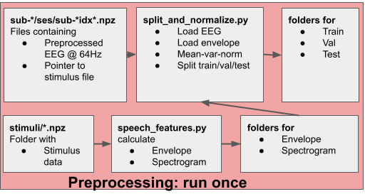
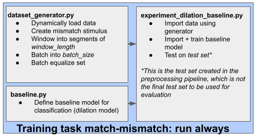
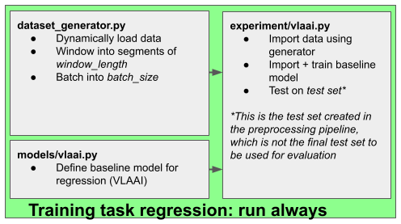

# Auditory-eeg-challenge-2023-code

## Preprocessing 
   - [Download and extract data](https://kuleuven-my.sharepoint.com/personal/lies_bollens_kuleuven_be/_layouts/15/onedrive.aspx?id=%2Fpersonal%2Flies%5Fbollens%5Fkuleuven%5Fbe%2FDocuments%2FICASSP%2D2023%2Deeg%2Ddecoding%2Dchallenge%2Ddataset&ga=1)
   - Adapt root directory in **util/dataset_root_dir.json**
   - Run **speech_features.py** to create envelope and mel spectrogram representations 
   

    

## Task1: Match-mismatch
   - Run **split_and_normalize.py** to create a training/val set, normalize and link EEG to speech representations
   - Run **experiment_dilation_baseline.py** to train the baseline model  
    
    

  

## Task2: regression (reconstructing envelope from EEG)
  - Run **experiment/vlaai.py** to train the baseline vlaai model 
  - Or run **experiment/linear_baseline.py** to train the linear baseline model
 
    
