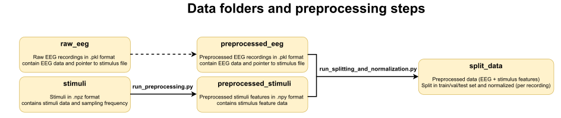

Auditory-eeg-challenge-2023-code
================================
This is the codebase for the [2023 ICASSP Auditory EEG challenge](https://exporl.github.io/auditory-eeg-challenge-2023).
This codebase contains baseline models and code to preprocess stimuli for both tasks.

# Prerequisites

Python >= 3.6

# General setup

Steps to get a working setup:

## 1. Clone this repository and install the [requirements.txt](requirements.txt)
```bash
# Clone this repository
git clone https://github.com/exporl/auditory-eeg-challenge-2023-code

# Go to the root folder
cd auditory-eeg-challenge-2023-code

# Optional: install a virtual environment
python3 -m venv venv # Optional
source venv/bin/activate # Optional

# Install requirements.txt
python3 -m install requirements.txt
```

## 2. [Download the data](https://kuleuven-my.sharepoint.com/personal/lies_bollens_kuleuven_be/_layouts/15/onedrive.aspx?id=%2Fpersonal%2Flies%5Fbollens%5Fkuleuven%5Fbe%2FDocuments%2FICASSP%2D2023%2Deeg%2Ddecoding%2Dchallenge%2Ddataset&ga=1) 

You will need a password, which you will receive when you [register](https://exporl.github.io/auditory-eeg-challenge-2023/registration/).
The folder contains multiple folders (and `zip` files containing the same data as their corresponding folders). For bulk downloading, we recommend using the `zip` files, as there is a bug in Onedrive when it has to zip files >= 4GB resulting in "corrupt" zip archives.

   1. `split_data(.zip)` contains already preprocessed, split and normalized data; ready for model training/evaluation. 
If you want to get started quickly, you can opt to only download this folder/zipfile.

   2. `preprocessed_eeg(.zip)` and `preprocessed_stimuli(.zip)` contain preprocessed EEG and stimuli files (envelope and mel features) respectively.
At this stage data is not yet split into different sets and normalized. To go from this to the data in `split_data`, you will have to run the `speech_features.py` script ([task1_match_mismatch/create_data/speech_features.py](./task1_match_mismatch/create_data/speech_features.py) for task 1 and [task2_regression/create_data/speech_features.py](./task2_regression/create_data/speech_features.py) for task 2).

   3. `raw_eeg(.zip)` and `stimuli(.zip)` contain the raw EEG and stimuli files. If you want to process the stimuli files, you can run `split_and_normalize.py` (([task1_match_mismatch/create_data/split_and_normalize.py](./task1_match_mismatch/create_data/split_and_normalize.py) for task 1 and [task2_regression/create_data/split_and_normalize.py](./task2_regression/create_data/split_and_normalize.py) for task 2). The processed stimuli files will be stored in the `processed_stimuli` folder.
Currently, no preprocessing code is made available to preprocess EEG, so you will have to write your own implementation or use the precomputed `processed_eeg` folder.

Make sure to download/unzip these folders into the same folder (e.g. `challenge_folder_task1`) for each task.
Note that it is possible to use the same preprocessed (and split) dataset for both task 1 and task 2, but it is not required.




## 3. Adjust the `config.json` accordingly

Each task has a `config.json` defining the folder names and structure for the data (i.e. [task1_match_mismatch/util/config.json](./task1_match_mismatch/util/config.json) and [task2_regression/util/config.json](./task2_regression/util/config.json)).
Adjust `dataset_folder` in the `config.json` file from `null` to the absolute path to the folder containing all data (The `challenge_folder_task_1` from the previous point).
  

OK, you should be all setup now!

    

# Running the tasks

Each task has already some ready-to-go experiments files defined to give you a
baseline and make you acquainted with the problem. The experiment files live
in the `experiment` subfolder for each task. The training log,
best model and evaluation results will be stored in a folder called
`results_{experiment_name}`.

## Task1: Match-mismatch
    
By running [task1_match_mismatch/experiments/dilated_convolutional_model.py](./task1_match_mismatch/experiments/dilated_convolutional_model.py),
you can train the dilated convolutional model introduced by Accou et al. [(2021a)](https://doi.org/10.23919/Eusipco47968.2020.9287417) and [(2021b)](https://doi.org/10.1088/1741-2552/ac33e9).

Other models you might find interesting are [Decheveigné et al (2021)](https://www.sciencedirect.com/science/article/pii/S1053811918300338), [Monesi et al. (2020)](https://ieeexplore.ieee.org/abstract/document/9054000), [Monesi et al. (2021)](https://arxiv.org/abs/2106.09622),….

## Task2: Regression (reconstructing envelope from EEG)

By running [task2_regression/experiments/linear_baseline.py](./task2_regression/experiments/linear_baseline.py), you can 
train and evaluate a simple linear baseline model with Pearson correlation as a loss function, similar to the baseline model used in [Accou et al (2022)](https://www.biorxiv.org/content/10.1101/2022.09.28.509945).

By running [task2_regression/experiments/vlaai.py](./task2_regression/experiments/vlaai.py), you can train/evaluate
the VLAAI model as proposed by [Accou et al (2022)](https://www.biorxiv.org/content/10.1101/2022.09.28.509945). You can find a pre-trained model at [VLAAI's github page](https://github.com/exporl/vlaai).

Other models you might find interesting are: [Thornton et al. (2022)](https://iopscience.iop.org/article/10.1088/1741-2552/ac7976),...

# Previous version

If you are still using a previous version of this example code, we recommend updating to this version, as the test-set code and data will be made compatible for this version.
If you still like access to the previous version, you can find it [here](https://github.com/exporl/auditory-eeg-challenge-2023-code/tree/258b2d48bab4f2ac1da01b8c2aa30f6396063ff5)